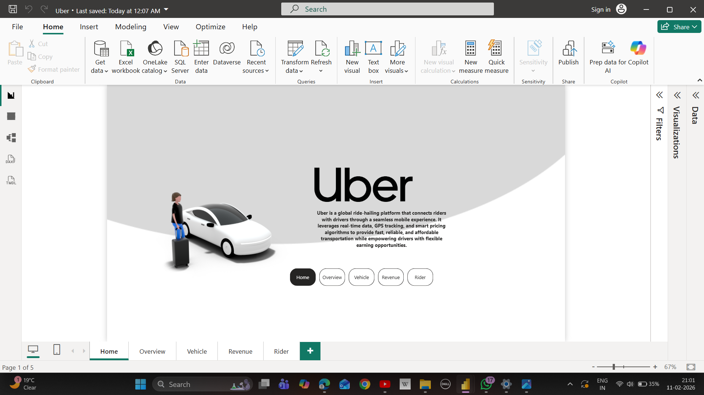
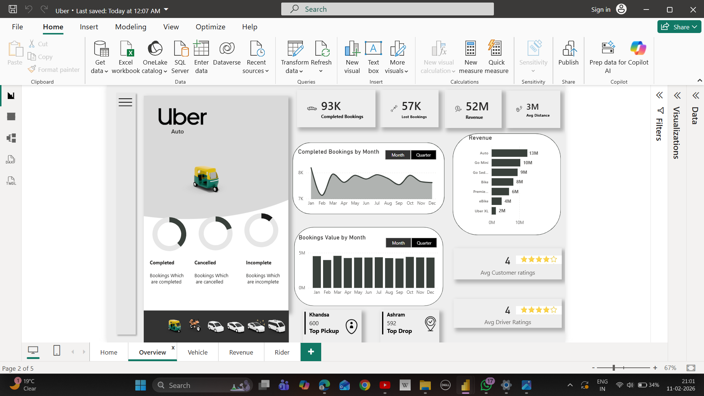
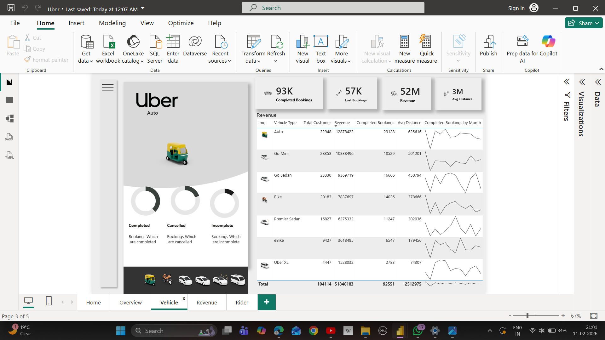
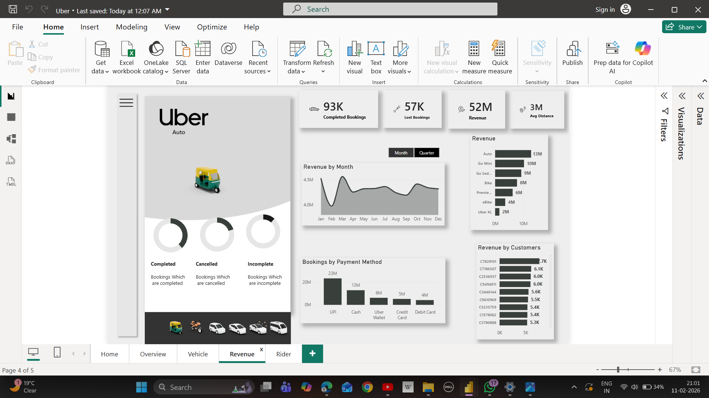
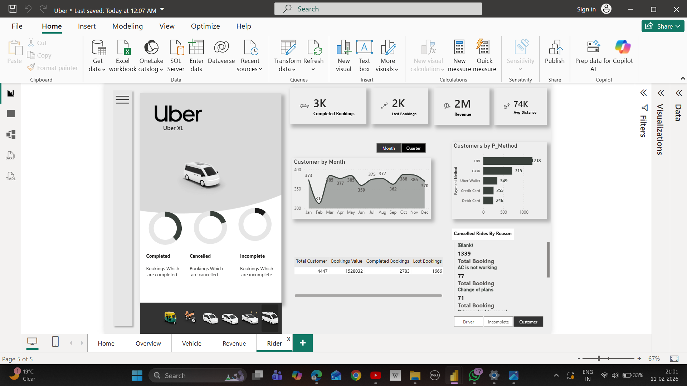

# Uber Business Analytics Dashboard – Power BI

## 📊 Project Overview
This project is a multi-page Power BI dashboard designed to analyze Uber’s business operations including trips, revenue, vehicle performance, and rider behavior.

The dashboard follows an enterprise-style structure with separate pages for Home, Overview, Vehicle, Revenue, and Rider analysis, allowing users to explore different aspects of the business interactively.

---

## 🛠 Tools Used
- Power BI Desktop  
- Microsoft Excel  
- GitHub  

---

## 📄 Dashboard Pages

### 🏠 Home
Landing page displaying high-level KPIs and navigation buttons for easy access to all sections.

### 📊 Overview
Provides overall operational performance including trips trend, city-wise analysis, average fare, and completion metrics.

### 🚗 Vehicle
Analyzes vehicle categories, utilization, trips by vehicle type, and revenue contribution.

### 💰 Revenue
Focuses on financial performance such as total revenue trends, city-wise revenue, vehicle-wise earnings, and peak business hours.

### 🧍 Rider
Examines customer behavior including total riders, repeat usage, ratings, and trip frequency.

---

## 📌 Key KPIs
- Total Trips  
- Total Revenue  
- Active Riders  
- Active Drivers  
- Average Fare  
- Customer Rating  

---

## 🔍 Business Insights
- Metro cities generate maximum revenue.
- Sedans lead in trip volume while SUVs show higher revenue per ride.
- Evening hours are peak earning periods.
- Repeat riders contribute majority of trips.
- Revenue growth shows seasonal patterns.

--- 

## Dashboard Preview

## 📁 Repository Structure
Dataset – Excel data  
PowerBI – PBIX dashboard file  
Screenshots – Dashboard images  
Documentation – Project explanation  

---

## 🎯 Outcome
This dashboard helps stakeholders monitor operational efficiency, optimize vehicle allocation, improve customer experience, and maximize revenue.

---

## 👤 Author
Rahul Singh  
BCA Graduate | Aspiring Data Analyst

